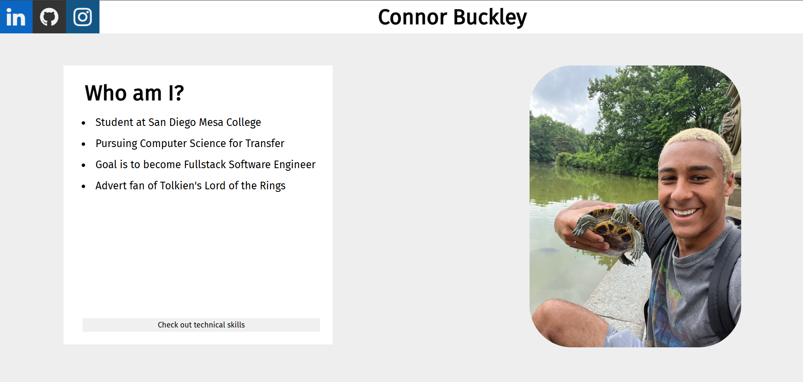

# Connor Buckley – Old Portfolio Website

This is first attempt at personal portfolio website

[https://connorb0531.github.io/portfolio-website/](https://connorb0531.github.io/portfolio-website/)

---

## Tech Stack

- React
- JavaScript
- HTML/CSS

---

## Screenshots

    
    

---

## Features

- Hero Page displaying personal info and portrait
- Buttin linked to sical medias
- Technical Skills page

---

## Notes

This `old-portfolio` branch reflects the initial version of the site before transitioning to React/Tailwind CSS and backend integration in later versions. For the most updated version, check the `main` branch.
