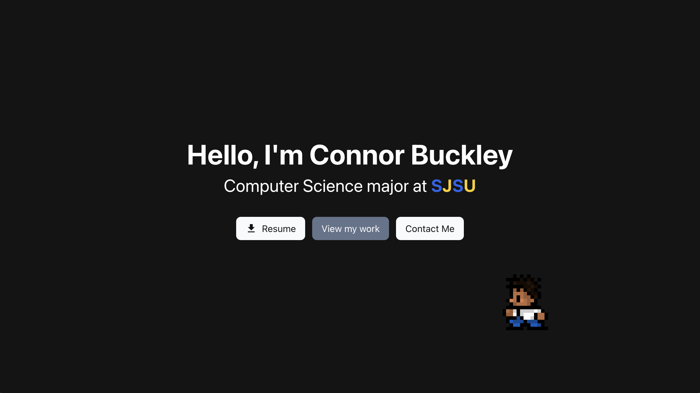

# Connor Buckley – Portfolio Website

A personal portfolio website showcasing my projects and skill as a Computer Science student.  
Built with **React** and styled using **Tailwind CSS**, featuring interactive animations powered by **PixiJS**.

  

  

## Live Link
[Portfolio Website](https://connorbuckley.dev)

## Features
- Responsive design for desktop and mobile
- Interactive hero section with animated sprite (PixiJS)
- Smooth navigation between sections
- Projects showcase with descriptions and tech stacks
- Contact form backend powered

## Tech Stack
### Frontend
- React (Vite)
- Tailwind CSS
- PixiJS (for animations)

### Backend
- Node.js
- Express.js
- Nodemailer (email handling)

## Deployment
- Frontend & Backend: Render

## License
MIT License